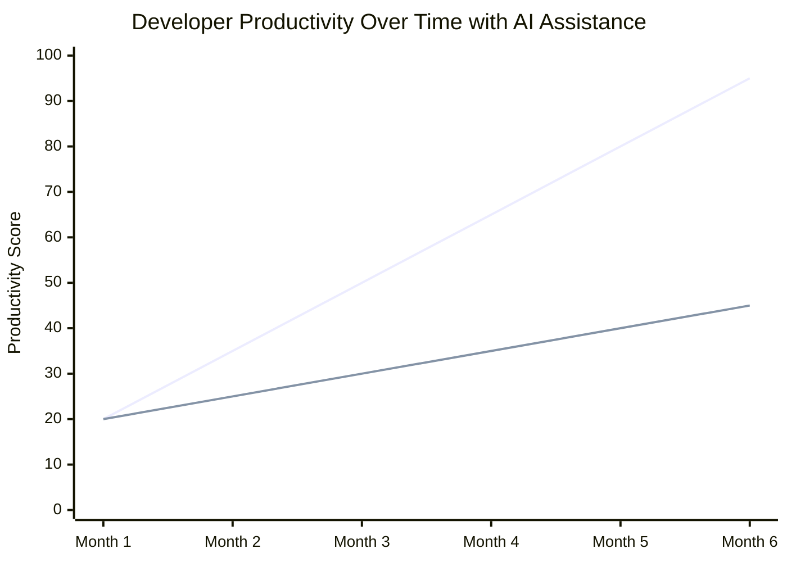

# Introduction

Content coming soon...

## Developer Productivity Growth with AI Assistance

The following graph demonstrates the linear growth in developer productivity when using AI-powered coding assistants like GitHub Copilot:

This linear progression shows how developers can experience consistent improvement in their coding efficiency and output quality when leveraging AI tools in their development workflow.
