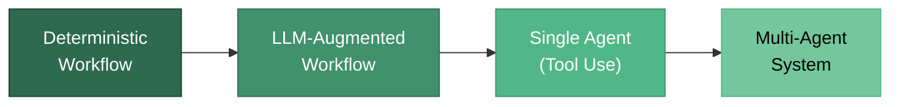
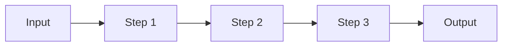
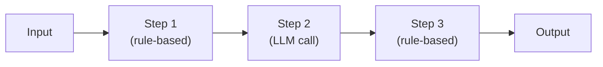
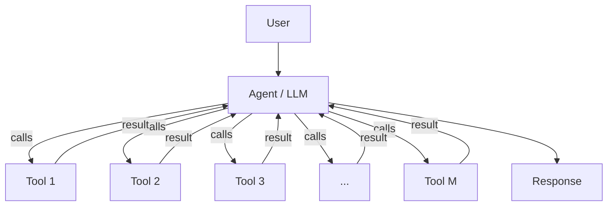
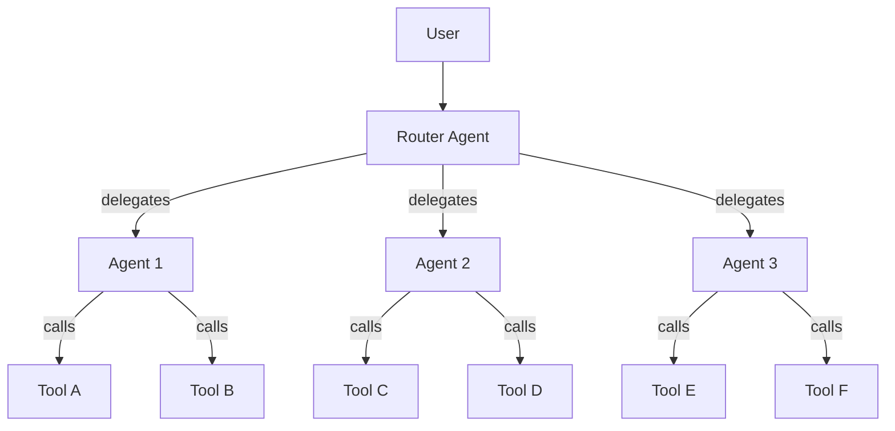
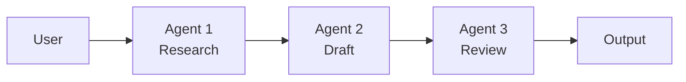
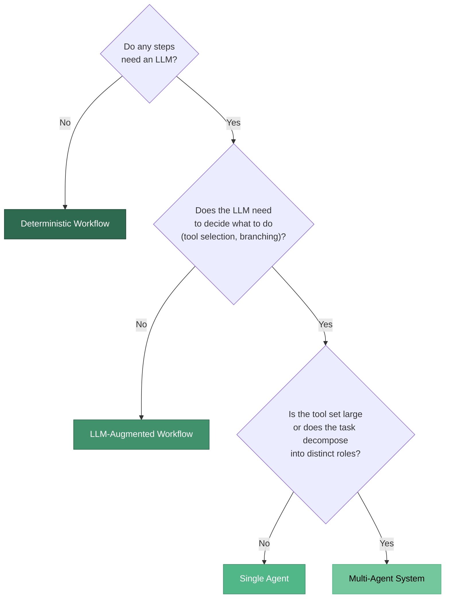

There is a spectrum of autonomy in AI systems. On one end you have fully deterministic workflows — fixed pipelines where every step is predefined. On the other end you have multi-agent architectures where several LLM-powered agents collaborate, delegate, and reason independently. Most real-world systems sit somewhere in between.

This post lays out a practical framework for choosing where on that spectrum your solution should live.

## The Spectrum

| Pattern | Control | When to use |
|---|---|---|
| **Deterministic workflow** | Full — every step is hard-coded | Steps are well-defined and rarely change |
| **LLM-augmented workflow** | High — pipeline is fixed, but individual steps call an LLM | Some steps need language understanding (extraction, classification) |
| **Single agent** | Medium — the LLM decides which tools to call and in what order | The task requires dynamic reasoning over a set of tools |
| **Multi-agent** | Low — multiple agents coordinate, each with its own tools and persona | The tool set is large, or the task naturally decomposes into distinct roles |

## Deterministic Workflows

A deterministic workflow is a fixed pipeline. No LLM is involved — or if it is, it operates within a single, predetermined step. Think of a classic ETL pipeline or a rule-based document classifier.

**Use when:** the problem is well-scoped, steps don't change, and you don't need language reasoning. This is the cheapest, most predictable, and easiest to debug architecture. Start here whenever you can.

## LLM-Augmented Workflows

When one or more steps in your pipeline need language understanding — entity extraction, summarisation, classification — you inject an LLM into those specific steps while keeping the overall flow deterministic.

**Use when:** most of the pipeline is predictable, but a few steps genuinely benefit from an LLM. The control flow is still yours — the model is a tool, not the orchestrator.

## Single Agent with Tools

An agent is an LLM that decides *what to do next*. You give it a set of tools (functions, APIs, databases) and a goal, and it reasons about which tools to call and in what order.

**Use when:** the task requires dynamic decision-making — the agent needs to decide which tool to call based on intermediate results. This is the sweet spot for many GenAI applications: a single LLM with a well-curated set of tools.

### The tool-scaling problem

This works well until your tool set grows. Research has shown that as the number of available tools increases, agent performance degrades — the model struggles to select the right tool from a large catalogue. This is where multi-agent systems come in.

## Multi-Agent Systems

The core idea is simple: instead of one agent with M tools, you have N agents, each with a focused subset of tools. A router (itself often an LLM) delegates incoming requests to the appropriate sub-agent.

**Use when:** your tool set has grown large enough that a single agent can no longer reliably select the right tool, or when the task naturally decomposes into distinct roles (e.g. a "research" agent, a "writing" agent, and a "review" agent).

### Sequential Multi-Agent Pipelines

A common variant is a sequential multi-agent pipeline, where agents hand off to each other in a chain — each agent completing one phase of the task before passing the result to the next.

This is structurally similar to a deterministic workflow, but each step involves an LLM with tool access and its own reasoning loop. The line between an "LLM-augmented workflow" and a "sequential multi-agent system" is genuinely blurry — and that is fine.

## Choosing the Right Architecture

The decision tree is straightforward:

Start simple. A deterministic workflow is always the cheapest, fastest, and most debuggable option. Graduate to more autonomous architectures only when the problem demands it.

## Closing Thoughts

Ultimately, the labels don't matter — impact does. Whether you call your system a "workflow", an "agent", or a "multi-agent architecture" is less important than whether it reliably solves the problem at hand. These patterns cover the vast majority of real-world needs. There is rarely a reason to reach for something more exotic.

The practical advice:

1. **Start with a workflow.** Hard-code what you can.
2. **Add LLM calls only where language understanding is required.**
3. **Move to an agent when the task needs dynamic tool selection.**
4. **Split into multiple agents when the tool set grows large** — it's been shown that segregating tools across specialised sub-agents improves reliability.
5. **Don't over-engineer.** A sequential workflow that works is better than an elaborate multi-agent system that doesn't.

This post was generated with genAI (more so than my other posts, will remove the label)

Blog post I love https://techcommunity.microsoft.com/blog/azure-ai-foundry-blog/closing-the-last-mile-in-document-ai-improving-extraction-quality-in-azure-conte/4502029

https://a9s.dev/blog/the-best-engineer-you-cant-hire