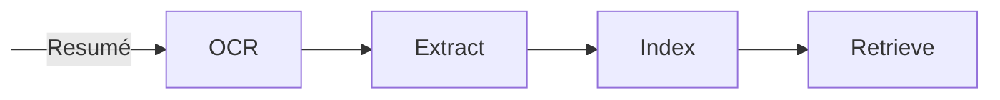

INTROCUTION
- Explain that while there is a body of literature on the topic realitu ius oftentiomes different. We seldom have access to user-intrewractions etc so we cant use user based and other methods so we are left with content based. 

- Job matching is inherelntly semantic. In a simplified version you hjave text (resume) and text (job descritpion). It becomes then a game of finding what is the most relevant job iei. some kind of semantic similairty as we say

- for that it turns out the methods haventy changed mych. What has changed is the cost but also how powerful the tech to operate it is -> cf larger embeeddings
Context: we don't have any data about user interactions -> we can't use content based or otehrs.

- Information extraction has also changed and is now simpler and m,ore poweferul than before with respect to variations in distro

- In this article we'll focus on both then theory, the practice and how to operationslise that .

- I work (at the time of writingh) at Microsoft so I'll have somewhat of a bias for the tech but will try to make this as genertic as possible so you can transfger to whatever teech stack you use

- What is available (omitting literature reserarch) and why it doesnt work

- What works
Two-Stage Retrieval + Ranking (Industry standard)
Embedding-Based Semantic Matching (Strong baseline, very scalable)

https://karpathy.github.io/2019/04/25/recipe/

The main families:

Collaborative Filtering

User-based — find users similar to you, recommend what they liked
Item-based — find items similar to ones you liked
Matrix Factorization — SVD, ALS (e.g., Netflix Prize approach)
Content-Based Filtering

Recommend items whose features (text, tags, metadata) match the user's profile or past preferences
TF-IDF, BM25, embedding similarity
Hybrid Methods

Combine collaborative + content-based (e.g., weighted, switching, or cascade)
LightFM is a well-known hybrid model
Knowledge-Based

Use explicit constraints/rules (e.g., "must be in location X, salary > Y")
Common in high-stakes domains like job matching, real estate
Deep Learning / Neural

Two-tower models — separate user and item encoders, dot-product scoring (Google, YouTube recommendations)
Sequential models — GRU4Rec, SASRec (model user behavior over time)
Graph Neural Networks — PinSage (Pinterest), model user-item interaction graphs
Cross-Encoder / Reranking

BERT-based pairwise scoring (as you noted in your post) — used as a second stage after retrieval
# The recipe 

4. Use weights + weighted average process
5. Top K
4. Retrieve (top k + retrieval algorightm)



Pseudocode:
```python
str content = ocr(resumé)

dict document = extract(content)

list vector = embed(content)

document[vector] = vector
```

resumé in -> mine -> embed -> filter on jobs -> retrieve top k

Other possible

N x M 
Instead of embedding separately, evaluate resume + job together.

Example input:

[CLS] Resume text [SEP] Job description [SEP]

Model outputs compatibility score.

Models:

BERT

RoBERTa

Pros

Highest semantic accuracy

Cons

Very slow for large datasets

Must be used only after retrieval

Typical pipeline:

Vector search -> top 200 jobs
Cross encoder -> rerank

resumé + job 

# Object character recognition (OCR)
For OCR, free mthods and paid ones including VLMs
# Extraction
For exccatrction, (LLMs, Azure Ai cONTENT Understnading, .. other methods)
# Indexing

For indexing we need to use a vector database.
Brief explaination of what it is. Some names (tables)

I used/uise Azure ai search

- You want to have a field containing your vector over the whole resume2 (after OCR)
- You want to have K fields where K is the number of information you mined at step Extract.
    Can be skills -> an array 
    years of experience -> ...
    anything 
Designing this effectively is more of an art. Not a hard science. You need to choose what makes sense for your use-case.

# Retrieval

# Evals
evaluating: /dev set and /test set

Relevant metrics:

```text
```
# Infrastructure
Use infra as code 
```text
/infra
    main.bicep
/src
    script.py
```

You need to expose this one way or another. 

For compute you can choose lambda functions, function serverless, containers I dont really care../. what ever works for you

I tend to roll with Azure Functions or Azure Container Apps. Never been much of a Kubernetes kinda guy (I'm too much of a Gen Z for that :p)

Once we have an accessible endpoint it's time to take care of basic security features. In a production environment you typically want to add an API Manager in front of your endpoint(s).

Once again, I roll with Azure API Management but you can use Kong or whatever suits your needs.

Talk about landing zone and production (dev prod, etc envioronemtsn and subs)

- Building the infrastructure
    - /infra
        - ACR + Docker
        - API + ACA
        - Microsoft Foundry 
        - Azure AI Content Understanding (document intelligence or any other solution)
        - APIM + Key Vault and basic security
        - Basic monitoring 
        - Blog Storage

