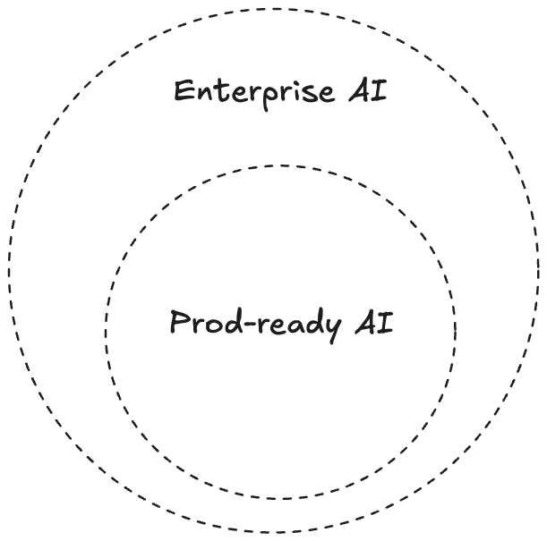

# Introduction

**TL;DR** The concept of enterprise AI is, in my view, frequently overcomplicated. I have encountered numerous instances where enterprise AI is conflated with production-ready AI, with practitioners treating the two as interchangeable. Others acknowledge only a subset of the characteristics that constitute enterprise AI while overlooking equally important factors.

My central claim is this: **every enterprise AI system is necessarily production-ready, but not every production-ready AI system qualifies as enterprise AI.**

I will substantiate this claim through formal logic, with a touch of set theory — because I love overthinking ;)

## So what *is* enterprise AI?

A definition that is reasonably correct is that enterprise AI seeks to solve business-level problems within organisations — typically focusing on automation, decision support, process optimisation, knowledge extraction, and customer operations.

I didn’t really bother crafting my own — I went on ChatGPT and asked for a definition. Since it’s trained on publicly accessible data, one could assume that its output tends to statistically represent the most commonly accepted definition.

As per ChatGPT’s words:
```
Enterprise AI is about:
- Integration with existing business systems (ERP, CRM, supply chains)
- Reliability, security, governance, and auditability requirements
- ROI-driven deployment rather than experimental performance
- Domain-specific training on company data
```

To continue my quest for an objective definition, I asked ChatGPT to look up definitions from the big hyperscalers: IBM, Salesforce, Amazon, Google, and Microsoft.

That’s where my first surprise came in: they all had different definitions. While some factors were similar or common, the essence of most definitions varied significantly.

<style>
table {
  border-collapse: collapse;
  width: 100%;
}
table th, table td {
  border: 2px solid #555;
  padding: 10px;
}
table th {
  background-color: #1a1a1a;
}
</style>

| Company | Definition for Enterprise AI |
|---------|------------------------------|
| [Google](https://cloud.google.com/discover/what-is-enterprise-ai?utm_source=chatgpt.com) | "Enterprise artificial intelligence (AI) is the application of AI technologies to address business challenges within <span style="background-color: red; color: white;">**an organization**</span>. It involves using machine learning, deep learning, natural language processing (NLP), and other AI techniques to automate processes, improve decision-making, and create new products and services. Enterprise AI goes beyond simple automation. It involves using AI to solve complex business problems that require human-like intelligence, such as understanding customer behavior, optimizing logistics, or detecting fraud. By leveraging large datasets and sophisticated algorithms, enterprise AI can help unlock insights, optimize operations, and drive innovation across various departments and functions." |
| [Amazon](https://aws.amazon.com/what-is/enterprise-ai//?utm_source=chatgpt.com) | "Enterprise artificial intelligence (AI) is the adoption of advanced AI technologies within <span style="background-color: red; color: white;">**large organizations**</span>. Taking AI systems from prototype to production introduces several challenges around <mark>scale</mark>, performance, data governance, ethics, and regulatory compliance. Enterprise AI includes policies, strategies, infrastructure, and technologies for widespread AI use within <span style="background-color: red; color: white;">**a large organization**</span>. Even though it requires significant investment and effort, enterprise AI is important for <span style="background-color: red; color: white;">**large organizations**</span> as AI systems become more mainstream." |
| [Salesforce](https://www.salesforce.com/artificial-intelligence/enterprise-ai/?utm_source=chatgpt.com) | "Enterprise AI is the application of AI for <span style="background-color: red; color: white;">**large organizations**</span>, helping boost workforce efficiency and productivity. It includes the use of autonomous agents and a combination of different AI technologies <mark>at scale</mark> — including machine learning, natural language processing (NLP), deep learning, computer vision, and automation — to change how people work across industries and sectors. This started with the first wave of predictive AI in 2016, and continued with the second wave of generative AI and copilots. Now, we’re on the third wave of AI: AI agents." |
| [IBM](https://www.ibm.com/think/topics/enterprise-ai?utm_source=chatgpt.com) | "Enterprise artificial intelligence (AI) is the integration of advanced AI-enabled technologies and techniques within <span style="background-color: red; color: white;">**large organizations**</span> to enhance business functions. It encompasses routine tasks such as data collection and analysis, plus more complex operations such as automation, customer service and risk management." |

All definitions mention **organisations**. Two of them mention ***large* organisations** specifically. Two of them mention the **scalability** factor.

Another notable finding is that Microsoft does not appear to have an official definition of enterprise AI. Formal definitions could only be sourced from Google, Amazon, Salesforce, and IBM.

Noticed anything? ChatGPT’s definition doesn’t perfectly align with what hyperscalers define as enterprise AI. The hyperscalers emphasise the *organisational context* — the sheer complexity of deploying AI within large, existing businesses — while ChatGPT’s definition reads more like a checklist of technical properties. Both perspectives are valid; they’re just looking at the same elephant from different angles.

# The hypothesis

> The set of Enterprise AI requirements is a superset of production AI requirements. Consequently, the set of Enterprise AI systems is a subset of production AI systems.

Let $E$ be the set of all Enterprise AI systems, $P$ be the set of all production-ready AI systems, $R_E$ be the set of requirements for Enterprise AI, and $R_P$ be the set of requirements for production-ready AI.

**In terms of requirements**, Enterprise AI demands everything production-ready AI does, and more:

$$R_P \subset R_E$$

**In terms of systems**, every Enterprise AI system is production-ready, but not vice versa — stricter requirements means fewer systems qualify:

$$E \subset P$$

Or equivalently:

$$(\forall x (x \in E \rightarrow x \in P)) \land (\exists y (y \in P \land y \notin E))$$



To prove this, we need to establish two things:
1. What production AI requires (the baseline, $R_P$)
2. What enterprise AI adds on top (the delta, $R_E \setminus R_P$)

# What production AI requires

**Assumption**: ChatGPT’s answer statistically reflects the commonly accepted definition.

As per ChatGPT’s words:
```
Production AI refers to artificial intelligence systems that are fully deployed,
live, and actively being used in real-world environments — not just prototypes,
experiments, or research models.

An AI system is considered production-grade when it includes more than just a
trained model. It also has:
- Reliability
- Monitoring & Logging
- Integration
- Security & Compliance
- Continuous Updates
```

This article is about enterprise AI, not production-ready AI systems, so I won’t belabour this. But we should note the overlap with the enterprise AI definition established above:

- **Reliability**, **integration**, and **security & compliance** appear in both definitions.

What remains are **continuous updates** and **monitoring & logging**. I posit that these are not independent requirements but rather *necessary conditions* for the shared ones:

- Continuous updates are a necessary condition for reliability — a system that is never updated will eventually degrade.
- Monitoring & logging are a necessary condition for security & compliance — you cannot audit what you do not observe.

Let $C$ be the set of systems with continuous updates, $R$ the set of reliable systems, $M$ the set of systems with monitoring & logging, and $SC$ the set of systems with security & compliance.

$$R \subset C \quad \Longleftrightarrow \quad \forall x (x \in R \rightarrow x \in C)$$

$$SC \subset M \quad \Longleftrightarrow \quad \forall x (x \in SC \rightarrow x \in M)$$

In other words: every production AI requirement is either directly shared with enterprise AI, or is *implied by* a shared requirement. This establishes that $R_P \subseteq R_E$. The question now is: what does enterprise AI add?

# What enterprise AI adds

This is the delta — the requirements in $R_E \setminus R_P$ that separate enterprise AI from merely production-ready AI. Drawing from the definitions above, I identify four additional dimensions.

## Integration across heterogeneous systems

Enterprise AI operates within organisations — often large ones. Such organisations typically employ a heterogeneous landscape of software systems and technology stacks. This is rooted in a legacy of on-premises infrastructure, but equally driven by a strategic imperative to mitigate over-reliance on any single hyperscaler.

As a consequence, Enterprise AI necessitates an ecosystem that facilitates interoperability across disparate systems. In an organisation comprising $N$ systems, an Enterprise AI solution should be architected to accommodate the worst-case integration scenario — where the final solution must interface with all $N$ systems.

In human-friendly terms: you want to build on **standards** to avoid lock-in, whilst also leveraging platform-native shortcuts when you’re building within the same stack.

We’ve seen the rise of standards across agentic systems with MCP and A2A. This is still a work in progress, but it’s fair to assume that choosing technologies that support both is now the prudent choice. Platforms such as Amazon Bedrock and Microsoft Foundry also provide rich ecosystems to accelerate your journey when you’re already committed to a stack.

Note that production AI also requires *integration* — but typically with a single system or a known, controlled set of consumers. Enterprise AI requires integration at a fundamentally different level of complexity.

## Governance & auditability

A production AI system needs security and compliance. But enterprise AI introduces a layer above that: **governance** — the organisational policies, processes, and controls that dictate how AI is developed, deployed, and operated across the business.

What are you governing? It depends on where you are on the maturity curve:
- At the simplest level, you might just want to govern your **endpoints and models** — at minimum for cost control.
- At the next level, you govern **data access, model lifecycles, and approval workflows**.
- At full maturity, you govern the **entire AI supply chain**: from data provenance, through model training and evaluation, to deployment and retirement.

Auditability is the enforcement mechanism for governance. If you cannot trace *who* did *what*, *when*, and *why*, governance is just a policy document gathering dust. This means logging, lineage tracking, and reproducibility are not optional — they are structural requirements.

## Organisational strategy

None of the hyperscaler definitions frame enterprise AI as a purely technical endeavour. Amazon explicitly mentions "policies, strategies, infrastructure." This is not accidental.

Enterprise AI requires top-down organisational alignment. We’ve seen the rise of the **AI Centre of Excellence (CoE)** — a dedicated unit that centralises AI expertise, sets standards, and coordinates adoption across departments. This isn’t just a Microsoft thing: Oracle, IBM, SAP, and major consultancies all operate some form of AI CoE.

The existence of a CoE — or at least a coherent, cross-functional AI strategy — is what separates an organisation that *uses* AI from one that deploys *enterprise* AI. Without it, you get disconnected teams building disconnected prototypes, which is the opposite of what the hyperscaler definitions describe.

## Domain-specific data leverage

ChatGPT’s definition includes "domain-specific training on company data." This is the requirement that transforms a generic AI capability into an enterprise asset.

A production-ready RAG system grounded on public documentation is production AI. The same architecture grounded on proprietary company data — customer records, internal knowledge bases, operational telemetry — with appropriate access control and data governance, is enterprise AI.

The distinction isn’t the technique; it’s the **data provenance and the organisational trust** required to use it.

# The reliability ≠ scalability trap

This deserves its own section because it’s the most common misconception I encounter.

Let $S$ be the set of systems requiring scalability, $R$ the set of systems requiring reliability, and $P$ the set of all production systems.

$$S \subset R \subset P$$

Reliability is a byproduct of production — any system running in production must be reliable, full stop. But I have seen countless times people directly associating scalability with enterprise AI, as if the two were synonymous. While reliability *can* entail scalability, it doesn’t necessarily have to.

Consider: an internal low-traffic AI system used by a handful of employees needs to be reliable but need not be scalable. On the other hand, customer-facing AI systems (e.g. B2B or B2C) can absolutely demand scalability, where SLAs and resilience become paramount.

In other words, enterprise AI should be ***ready*** for scale — but not necessarily ***built*** for it from day one. Over-engineering for scale on a system that serves 50 users is not enterprise-grade thinking; it’s waste.

# Towards a decision framework

If we view a company as a system with AI solutions flowing through it — from data sources ($A$) to consumption points ($B$: an internal Teams chat, a customer-facing product, a decision-support dashboard) — then the enterprise AI problem can be framed as an optimisation:

**Maximise:**
- Security posture
- Integration breadth (number of systems the solution can interoperate with)
- Maintainability
- Interoperability (adherence to standards)
- Governance coverage

**While minimising:**
- Implementation effort
- Operational complexity
- Time to value

The practical implication: not every AI project within an enterprise *needs* to be enterprise AI. Internal tools, one-off analyses, and experimental prototypes can and should be built as production AI (or less). The enterprise AI apparatus — governance, cross-system integration, organisational strategy — should be reserved for systems that warrant it.

The decision hinges on two questions:
1. **Where does the data come from?** If it touches proprietary or sensitive company data, enterprise-grade governance applies.
2. **Where does the output go?** If it’s customer-facing, crosses departmental boundaries, or feeds into business-critical processes, enterprise-grade reliability and integration apply.

When *both* answers point to high organisational impact, you’re looking at enterprise AI. Otherwise, you might just need production AI — and that’s perfectly fine.

# Conclusion

Enterprise AI is not a marketing label and it is not a synonym for "production-ready." It is a strict superset of production AI requirements: everything production demands, plus organisational strategy, cross-system integration, governance, and domain-specific data leverage.

$$R_P \subset R_E \implies E \subset P$$

The next time someone presents a production-ready AI system and calls it "enterprise AI," ask them: *Where is the governance? Where is the cross-system integration? Where is the organisational strategy?* If the answer is silence, what they have is a solid production system — which is commendable — but it’s not enterprise AI.

And conversely: if you’re building enterprise AI, don’t let the weight of the label paralyse you. Start with production-grade foundations, then layer on the enterprise dimensions where they matter. Not every internal tool needs a CoE approval chain. Be *ready* for enterprise — don’t over-engineer for it from day zero.
